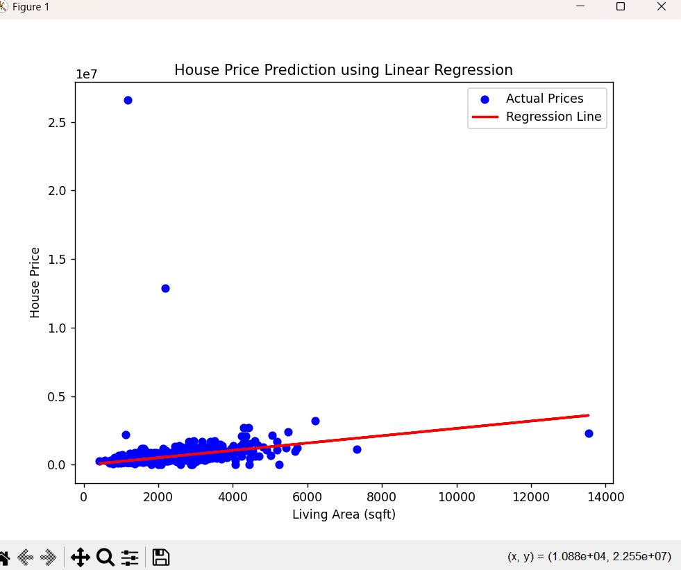

# 📈 House Price Prediction using Linear Regression

This project demonstrates the implementation of **Simple Linear Regression** using **Scikit-learn** to predict house prices based on the **living area (`sqft_living`)**. It covers the complete machine learning workflow, including data loading, preprocessing, model training, evaluation, and visualization.

---

## 📌 Objective

The objective of this project is to understand and implement **Simple Linear Regression** for predicting house prices using a real-world housing dataset.

---

## 🛠️ Tools & Technologies

- Python
- Pandas
- NumPy
- Scikit-learn
- Matplotlib

---

## 📂 Dataset

**Dataset:** House Price Dataset

The dataset contains several house-related features, including:

- Price
- Bedrooms
- Bathrooms
- Living Area (`sqft_living`)
- Lot Area (`sqft_lot`)
- Floors
- Waterfront
- View
- Condition
- Grade
- Year Built
- Year Renovated
- Street
- City
- State
- Country

### Target Variable

- **price**

### Feature Used

- **sqft_living**

---

## 📋 Project Workflow

1. Import the required libraries.
2. Load the housing dataset.
3. Explore and understand the dataset.
4. Select the feature (`sqft_living`) and target (`price`).
5. Split the dataset into training and testing sets.
6. Train the Linear Regression model.
7. Predict house prices.
8. Evaluate the model using:
   - Mean Absolute Error (MAE)
   - Mean Squared Error (MSE)
   - R² Score
9. Visualize the regression line.

---

## 📊 Model Evaluation Metrics

The model performance is evaluated using:

- ✅ Mean Absolute Error (MAE)
- ✅ Mean Squared Error (MSE)
- ✅ R² Score

These metrics help determine how accurately the model predicts house prices.

---

## 📈 Regression Plot

The generated regression graph displays:

- 🔵 Blue Dots → Actual House Prices
- 🔴 Red Line → Predicted Regression Line

---

# 📸 Project Screenshots

## 💻 Console Output

.png)

---

## 📊 Regression Plot



---

## ▶️ How to Run

### Step 1: Install Required Libraries

```bash
pip install pandas matplotlib scikit-learn
```

### Step 2: Run the Project

```bash
python task3.py
```

---

## 📁 Project Structure

```
Linear-Regression/
│── House-Price.csv
│── task3.py
│── README.md
│── screenshots/
│   ├── output (2).png
│   └── Regression.png
```

---

## 📌 Sample Output

```
========== MODEL EVALUATION ==========

Mean Absolute Error (MAE): XXXXX.XX

Mean Squared Error (MSE): XXXXX.XX

R² Score: 0.XX

========== MODEL PARAMETERS ==========

Coefficient (Slope): XXXXX.XX

Intercept: XXXXX.XX

========== INTERPRETATION ==========

Every additional square foot increases the predicted house price.
```

---

## 📚 What I Learned

- Understanding Simple Linear Regression
- Data preprocessing using Pandas
- Splitting datasets into training and testing sets
- Building Machine Learning models using Scikit-learn
- Evaluating regression models using MAE, MSE, and R² Score
- Visualizing data using Matplotlib
- Interpreting regression coefficients

---

## 🚀 Future Improvements

- Implement Multiple Linear Regression.
- Perform feature engineering.
- Apply feature scaling.
- Compare Linear Regression with Ridge and Lasso Regression.
- Build a web application for house price prediction using Flask or Streamlit.

---

## ⭐ Project Highlights

- ✔ Real-world House Price Dataset
- ✔ Simple Linear Regression
- ✔ Data Preprocessing
- ✔ Model Training
- ✔ Prediction & Evaluation
- ✔ Data Visualization
- ✔ Beginner-Friendly Machine Learning Project

---

## 👨‍💻 Author

**Pragya Pathak**

**B.Tech Computer Science Engineering (Machine Learning)**

**Lovely Professional University**

---

## 🌟 Support

If you found this project useful, consider giving it a ⭐ on GitHub!